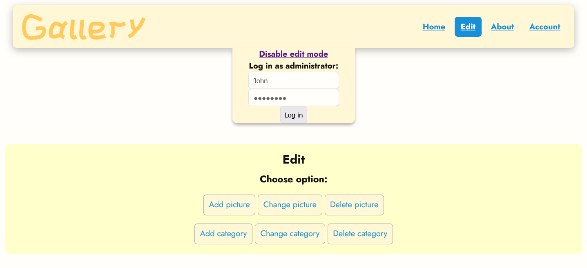
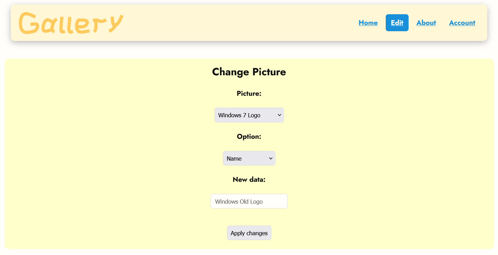

# 

**Gallery** is a lightweight Node.js application for serving and managing public or private collections of images and documents for organizations or personal projects. It focuses on simple setup, local hosting options (including router-hosting), and easy integration.


Key use cases:
- Public hosting on a dedicated or built-in domain
- Hosting behind an organization's router for local access
- Personal or small-team private galleries

**Please note**: This project is in **beta** and is not a stable solution.

## Features
- Browser-based gallery for images and documents
- Simple file-based storage and static serving
- Basic admin/upload UI and configurable upload permissions
- Easy to integrate into other Node.js projects

## Installation


```bash
git clone https://github.com/2012Miron/Gallery
cd Gallery
npm install --production
npm run start
```

By default the app serves on the port configured in `settings.json`. See the Settings & Managing guide for configuration options.

The default root password is `1234567890`. Change it after first login.

## Documentation
See the detailed information in the `docs/` folder:
- [Settings & Managing](docs/Setting&Managing.md)
- [Hosting on the router](docs/RouterHosting.md)
- [Contributing](docs/Contributing.md)
- [Translating](docs/Translating.md)

## Quick usage
- Upload images via the admin UI.
- Place static images in the `pictures/` or `imgs/` folders for direct serving.
- Customize styles in `resources/styles.css` and frontend behavior in `js/`.

## Support & Contribution
The project is currently in beta. Contributions, bug reports, and improvements are welcome.
See the contributing file in the `docs/` folder for guidelines.

## License
This project licensed under MIT License.

## Screenshots



